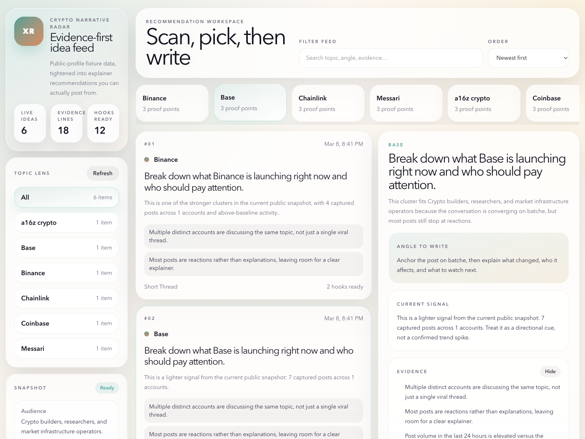

# X Trend Idea MVP



Explanation-first content recommendation MVP built around public X signals.

This project is intentionally not a full X analytics platform. It is a practical MVP for:

- collecting visible public X posts into local fixture data
- clustering posts into topic buckets
- generating explanatory recommendations with `why_now`, `suggested_angle`, `evidence`, `risks`, and `draft_hooks`
- browsing the output in a local React UI

## What Is Useful Today

The current useful parts are:

- `No-spend research path`
  You can generate real fixture data from public X profile pages without paying for X API credits.

- `Crypto signal workflow`
  There is a curated crypto org/KOL account list plus a ready fixture pipeline.

- `Explanation-first output`
  The app does not just return topic labels. It returns recommendation objects with a snapshot read, suggested angle, evidence, cautions, and opening ideas.

- `Safer recommendation fallback`
  The recommendation layer now uses TF-IDF phrase extraction plus snapshot-aware fallbacks. If the extracted phrase is weak, the app falls back to the topic label instead of pretending it found a precise insight.

- `Interactive local UI`
  The frontend reads the live API and lets you filter, browse, and inspect recommendations in a cleaner feed-style layout.

- `Cleaner re-import path`
  Re-running fixture imports now clears old audience-linked data correctly instead of silently mixing stale and fresh posts.

## Current Limitations

- Public profile extraction is still partial. Some requested KOL handles may yield no captured posts.
- The recommendation layer is improved, but not learned end-to-end. TF-IDF helps suppress some noise, while `frame` and fallback behavior are still heuristic.
- This is snapshot-driven, not live trend intelligence.
- Sparse or promo-heavy clusters will intentionally collapse to broader copy like `Write a short evidence-led brief on Messari...` instead of fake specificity.
- The app currently works better for `org + ecosystem signal` than for broad `individual KOL discourse`.

## Project Layout

- Backend API: [main.py](./main.py)
- Recommendation logic: [recommendations.py](./services/recommendations.py)
- Clustering logic: [clustering.py](./services/clustering.py)
- Fixture ingestion: [fixture_ingestion.py](./services/fixture_ingestion.py)
- Public profile extractor: [public_profile_to_fixture.py](./scripts/public_profile_to_fixture.py)
- One-shot pipeline runner: [run_fixture_pipeline.py](./scripts/run_fixture_pipeline.py)
- Frontend: [frontend/src/App.jsx](./frontend/src/App.jsx)
- Tailwind styling: [frontend/src/styles.css](./frontend/src/styles.css)

## Install

Backend:

```bash
cd /Users/fred/GPT-CODE
python3 -m venv .venv
. .venv/bin/activate
.venv/bin/pip install -e /Users/fred/GPT-CODE/x_trend_idea_mvp
```

Frontend:

```bash
cd /Users/fred/GPT-CODE/x_trend_idea_mvp/frontend
npm install
```

Optional for public-profile extraction:

```bash
. /Users/fred/GPT-CODE/.venv/bin/activate
.venv/bin/pip install playwright
playwright install chromium
```

## Fastest Local Run

If you just want to see the app working with the current crypto fixture:

```bash
cd /Users/fred/GPT-CODE
. .venv/bin/activate

.venv/bin/python -m x_trend_idea_mvp.scripts.run_fixture_pipeline \
  --preset crypto-signals \
  --fixture-path /Users/fred/GPT-CODE/x_trend_idea_mvp/fixtures/crypto_expanded_snapshot_2026-03-08.json \
  --lookback-days 30 \
  --max-recommendations 8

.venv/bin/uvicorn x_trend_idea_mvp.main:app --host 127.0.0.1 --port 8003
```

Open:

- [http://127.0.0.1:8003/](http://127.0.0.1:8003/)
- [http://127.0.0.1:8003/health](http://127.0.0.1:8003/health)

## Verification

Quick checks:

```bash
cd /Users/fred/GPT-CODE
python3 -m compileall /Users/fred/GPT-CODE/x_trend_idea_mvp
cd /Users/fred/GPT-CODE/x_trend_idea_mvp/frontend
npm run build
cd /Users/fred/GPT-CODE
curl -s http://127.0.0.1:8003/health
curl -s 'http://127.0.0.1:8003/recommendations?audience_id=b3564638-516e-4592-98b6-a21cc59a27cb'
```

Expected current shape:

- around `70` imported posts from the expanded fixture
- around `6` topic clusters on the current corpus
- recommendation topics such as `Binance`, `Base`, `Chainlink`, `Messari`, `Solana`, `Coinbase`
- snapshot-aware recommendation copy that falls back to broader briefs when phrase confidence is weak

## Fresh Fixture Workflow

Curated source lists:

- [crypto_expanded_accounts_2026-03-08.json](./fixtures/crypto_expanded_accounts_2026-03-08.json)
- [crypto_kol_accounts_2026-03-08.json](./fixtures/crypto_kol_accounts_2026-03-08.json)

If you want a fresh public-profile snapshot instead of the checked-in fixture:

```bash
cd /Users/fred/GPT-CODE
. .venv/bin/activate

.venv/bin/python -m x_trend_idea_mvp.scripts.public_profile_to_fixture \
  --handles-file /Users/fred/GPT-CODE/x_trend_idea_mvp/fixtures/crypto_expanded_accounts_2026-03-08.json \
  --tracked-query-id CRYPTO_EXPANDED \
  --posts-per-handle 10 \
  --lookback-days 30 \
  --concurrency 6 \
  --scroll-rounds 8 \
  --output /Users/fred/GPT-CODE/x_trend_idea_mvp/fixtures/crypto_expanded_snapshot_2026-03-08.json

.venv/bin/python -m x_trend_idea_mvp.scripts.run_fixture_pipeline \
  --preset crypto-signals \
  --fixture-path /Users/fred/GPT-CODE/x_trend_idea_mvp/fixtures/crypto_expanded_snapshot_2026-03-08.json \
  --lookback-days 30 \
  --max-recommendations 8
```

The extractor now writes a `diagnostics` block into the fixture output so you can see which handles loaded, which produced authored posts, and why individual articles were skipped.

## Live X API Path

There is still a live X ingestion path in the codebase, but it requires:

- `X_BEARER_TOKEN`
- usable X API credits
- network access

Set these for live ingestion:

- `DATABASE_URL`
- `X_BEARER_TOKEN`

Optional:

- `X_API_BASE_URL`
- `X_PAGE_SIZE`

Relevant code:

- [ingestion.py](./services/ingestion.py)
- [x_api.py](./services/x_api.py)

## API Surface

Current endpoints:

- `POST /audiences`
- `POST /queries`
- `POST /ingest/x`
- `POST /ingest/fixture`
- `POST /clusters/build`
- `POST /recommendations/generate`
- `GET /recommendations?audience_id=...`
- `GET /topics?audience_id=...`
- `GET /health`

## What To Do Next

The highest-value next steps are backend, not more frontend polish:

1. Improve KOL extraction quality.
   Right now many requested KOL handles still produce zero captured posts in the public-profile flow.

2. Improve topic summarization.
   The phrase extractor is better than before, but weak clusters still need a stronger summarization path than raw TF-IDF plus heuristics.

3. Separate org signal from KOL signal.
   The current expanded crypto corpus is still dominated by org accounts like `MessariCrypto`, `coinbase`, `base`, and `binance`.

4. Replace heuristic framing.
   `frame` is still inferred from marker words such as `launch`, `research`, and `market-structure`. That should either become a small classifier or be hidden when confidence is low.

5. Add representative post surfacing in the UI.
   The recommendation cards should link back to the strongest source posts instead of only showing generic evidence bullets.

6. Add a small evaluation harness.
   Save fixture snapshots plus expected cluster labels so clustering changes can be regression-tested.

7. Decide the product direction explicitly.
   Either:
   - `org/account research tool`
   - `KOL narrative monitor`
   - `idea generator for a single connected audience`

Those are different products and the extraction/ranking logic should diverge accordingly.
